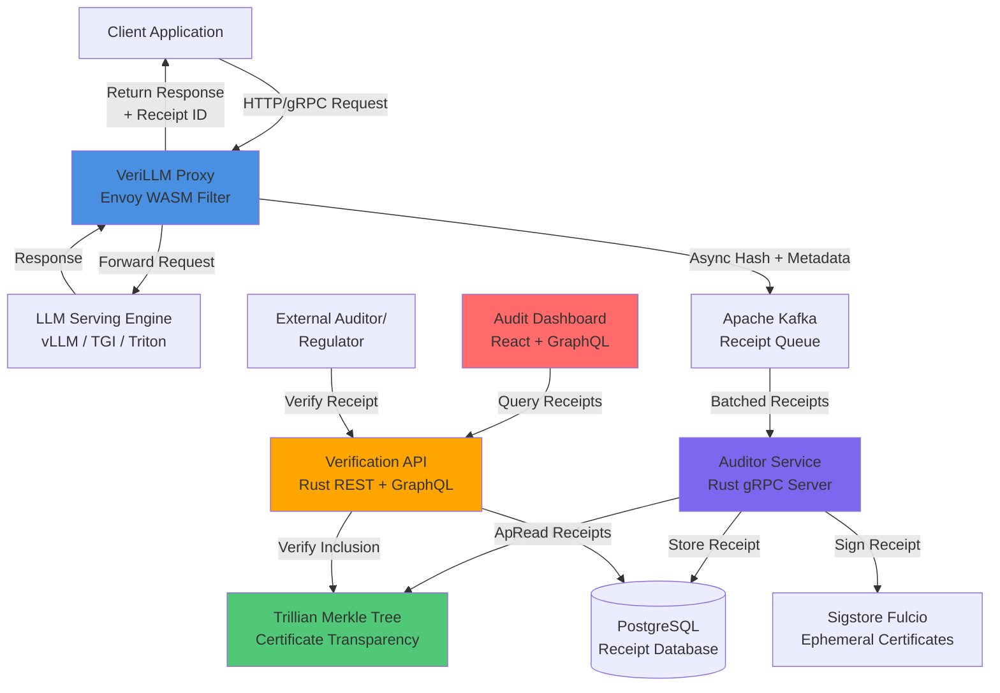

# Open Source Publication - Cryptographic Receipts for Verifiable AI Inference

<table>
<tr>
<td width="200">
  
</td>
<td>
  <h3>Transform Black-Box AI into Legally Defensible, Auditable Artefacts</h3>
  
  **Core Capabilities:**
  - 🌟 Cryptographically Signed Inference Receipts
  - 🌟 Tamper-Evident Audit Trails with Merkle Tree Verification
  - 🌟 Sub-5ms Overhead on Production LLM Serving
  - 🌟 Healthcare & Finance-Ready Compliance (HIPAA, GDPR, EU AI Act)
  - 🌟 Complete Model Lineage Tracking (Versions, Adapters, Hyperparameters)
  - 🌟 Cloud-Agnostic Integration (AWS, Azure, GCP)
</td>
</tr>
</table>

<p align="center"> 
  <a href="https://github.com/verillm/verillm/releases"></a>
  <a href="https://opensource.org/licenses/MIT"></a>
  <a href="https://github.com/verillm/verillm/pulls"></a>
  <a href="https://goreportcard.com/report/github.com/verillm/verillm"></a>
</p>

<p align="center">
  <a href="#about">About</a> •
  <a href="#the-problem">The Problem</a> •
  <a href="#key-features">Key Features</a> •
  <a href="#getting-started">Getting Started</a> •
  <a href="#installation">Installation</a> •
  <a href="#architecture">Architecture</a> •
  <a href="#verification">Verification</a> •
  <a href="#contributing">Contributing</a>
</p>

---

## About

**VeriLLM** is an open-source, cryptographic provenance platform that attaches a tamper-evident, digitally signed receipt to every inference response generated by a large language model. By integrating transparently into the serving path with sub-millisecond overhead, VeriLLM transforms opaque AI outputs into legally defensible, independently verifiable artefacts.

Traditional AI systems operate as black boxes—when a model produces a response, no one can definitively prove which model version was used, what configurations were active, or whether the deployment was authorized. VeriLLM solves this critical gap by providing cryptographic proof of:

- **Model Identity**: Exact version hash of the base model and all active adapters
- **Deployment Context**: Environment fingerprint, timestamp, and approval status  
- **Privacy Accountability**: Differential privacy budget consumption tracking
- **Regulatory Evidence**: Self-contained proofs for HIPAA, GDPR, and EU AI Act compliance

Built on battle-tested infrastructure from Certificate Transparency and Sigstore, VeriLLM brings the same level of cryptographic verifiability that secures web PKI to the entirely novel domain of AI inference. The platform serves enterprises running mission-critical AI workloads in healthcare, finance, legal, and public sectors—where trust in AI is not optional but mandatory.

**Why VeriLLM Matters**: When a hospital's AI misdiagnoses a patient, when a bank's model denies a loan unfairly, or when a legal AI gives incorrect advice, organizations face million-dollar lawsuits and cannot reconstruct what happened. VeriLLM ensures that every AI decision comes with a cryptographic receipt that can prove—to regulators, auditors, and affected individuals—exactly what the system did.

---

## Key Features

### 🌟 Cryptographic Receipts
Every inference generates a digitally signed receipt containing the complete decision context: model hash, adapter identifiers, hyperparameters, timestamp, and deployment environment. Receipts use BLAKE3 hashing and Ed25519 signatures anchored in a public transparency log, making them mathematically provable and independently verifiable without granting internal system access.

### 🌟 Tamper-Evident Audit Trails  
All receipts are appended to an immutable Merkle tree (powered by Google's Trillian) with cryptographic inclusion proofs. Any attempt to alter or delete a historical receipt is instantly detectable. Audit exports contain complete cryptographic chains that regulators can verify using open-source tools.

### 🌟 Production-Grade Performance
Sub-5ms p99 latency overhead when processing 10,000+ requests per second. Zero-copy hashing, batched Merkle tree updates, and asynchronous receipt generation ensure VeriLLM adds negligible latency to production serving. Works seamlessly with vLLM, HuggingFace TGI, NVIDIA Triton, and TensorFlow Serving.

### 🌟 Complete Model Lineage
Automatic capture of base model version hashes, LoRA/prefix adapter identifiers, prompt template IDs, and hyperparameter configurations. Service dependency mapping shows which models call which retrieval systems or external APIs. Critical path identification for debugging distributed AI systems.

---

## Getting Started

### Prerequisites
- Kubernetes cluster (or Docker Compose for development)
- Active LLM serving endpoint (vLLM, TGI, Triton, etc.)
- Basic understanding of HTTP proxies and Envoy

### Quick Start

```bash
# Install VeriLLM CLI
curl -sSL https://get.verillm.dev | sh

# Initialize configuration
verillm init --endpoint http://your-llm-server:8000

# Deploy as Envoy sidecar
verillm deploy sidecar --namespace ai-production

# Verify installation
verillm health-check
```

**Access your audit dashboard at:** `http://localhost:8080`

---

## Installation

### Kubernetes Deployment (Recommended)

```bash
# Add VeriLLM Helm repository
helm repo add verillm https://helm.verillm.dev
helm repo update

# Install VeriLLM stack (proxy, auditor, Trillian, dashboard)
helm install verillm verillm/verillm \
  --namespace verillm-system \
  --create-namespace \
  --set proxy.upstreamUrl=http://llm-server:8000 \
  --set sigstore.enabled=true

# Verify deployment
kubectl get pods -n verillm-system
```

### Docker Compose for Developement
```bash
# Clone repository
git clone https://github.com/verillm/verillm
cd verillm

# Configure environment
cp .env.example .env
# Edit .env with your LLM endpoint

# Start all services
docker-compose up -d

# View logs
docker-compose logs -f auditor
```

### Manual Installation For Advanced Analysis

```bash
# Build from source
git clone https://github.com/verillm/verillm
cd verillm

# Build WASM filter
cd proxy
cargo build --target wasm32-unknown-unknown --release
wasm-gc target/wasm32-unknown-unknown/release/verillm_filter.wasm

# Build Auditor Service
cd ../auditor
cargo build --release

# Build Dashboard
cd ../dashboard
npm install
npm run build

# Deploy infrastructure (Trillian, PostgreSQL, Kafka)
cd ../infrastructure/terraform
terraform init
terraform apply
```

---

## Architecture

### System Architecture Overview

VeriLLM implements a distributed, cloud-native architecture that processes inference receipts with cryptographic verifiability while maintaining sub-5ms latency overhead.



### Architecture Layers

#### 1. **Proxy Layer** (Envoy WASM)
Intercepts HTTP/gRPC requests and responses with zero changes to existing infrastructure. Canonicalizes inference context (request, response, model metadata) using deterministic JSON serialization, computes BLAKE3 hash, and asynchronously publishes to Kafka. Returns original response to client immediately with <1ms added latency.

#### 2. **Ingestion Layer** (Apache Kafka)
Provides durable, scalable buffering for receipt generation. Handles backpressure when auditor service is under load, ensures exactly-once semantics, and enables replay for disaster recovery. Supports multi-region replication for global deployments.

#### 3. **Auditing Layer** (Rust gRPC Service)
High-throughput receipt processor that batches Kafka messages, submits leaf hashes to Trillian Merkle tree, obtains ephemeral signing certificates from Sigstore Fulcio, generates Ed25519 signatures, and persists complete receipts to PostgreSQL with inclusion proofs.

#### 4. **Transparency Log** (Google Trillian)
Append-only Merkle tree providing cryptographic proof of receipt ordering and immutability. Supports millions of leaves per second, generates efficient O(log n) inclusion proofs, and integrates with Certificate Transparency ecosystem for external monitoring.

#### 5. **Verification Layer** (REST + GraphQL API)
Public endpoints for independent receipt verification. Performs three-step validation: hash recomputation from canonical context, Merkle inclusion proof verification against Trillian tree head, and Ed25519 signature verification using Sigstore public keys. No authentication required—cryptography provides trust.

#### 6. **Presentation Layer** (React Dashboard)
Real-time audit interface with receipt explorer, model lineage visualizer, privacy budget dashboard, and compliance export wizard. WebSocket updates for live receipt streaming, role-based access control via OIDC, and GraphQL for efficient data fetching.

### Key Technical Specifications

| Component | Technology | Performance Target |
|-----------|-----------|-------------------|
| **Proxy Overhead** | Envoy WASM (Rust) | < 5ms p99 latency |
| **Receipt Throughput** | Auditor Service | 20,000+ receipts/sec |
| **Hash Function** | BLAKE3 | ~1 GB/s single-core |
| **Signature Scheme** | Ed25519 via Sigstore | < 1ms per signature |
| **Tree Inclusion Proof** | Trillian Merkle Tree | O(log n) verification |
| **Storage Efficiency** | PostgreSQL + Partitioning | Time-series optimized |
| **Availability** | Multi-Region | 99.95% uptime SLA |

### Security Architecture

VeriLLM implements defense-in-depth security:

- **Cryptographic Primitives**: BLAKE3 for hashing, Ed25519 for signatures, Merkle trees for tamper-evidence
- **Key Management**: Ephemeral certificates via Sigstore Fulcio (10-minute validity), no long-lived secrets
- **Data Protection**: AES-256 encryption at rest, TLS 1.3 in transit, optional PII redaction
- **Access Control**: Role-based permissions, OIDC integration, multi-tenancy support
- **Audit Trail**: Complete audit log of all verification requests and administrative actions
- **Compliance**: GDPR, HIPAA, SOC 2, and EU AI Act readiness

---

## Verification

### Verifying a Receipt

Any party—clinician, patient, regulator, or auditor—can independently verify a VeriLLM receipt without requiring access to internal systems.

#### Command-Line Verification

```bash
# Install verification tool
npm install -g @verillm/verify-cli

# Verify a receipt from file
verillm-verify --receipt receipt.json

# Verify from URL
verillm-verify --url https://api.verillm.dev/receipts/abc123

# Output:
# ✓ Hash matches canonical context
# ✓ Merkle inclusion proof valid (tree size: 1,245,678)
# ✓ Signature valid (Sigstore certificate: CN=auditor-prod)
# ✓ Receipt verified successfully
```

#### Programmatic Verification (JavaScript)

```javascript
const { ReceiptVerifier } = require('@verillm/verify');

const verifier = new ReceiptVerifier({
  trillianEndpoint: 'https://trillian.verillm.dev',
  sigstoreRekor: 'https://rekor.sigstore.dev'
});

async function verifyReceipt(receiptJson) {
  const result = await verifier.verify(receiptJson);
  
  if (result.valid) {
    console.log('Receipt verified!');
    console.log(`Model: ${result.context.modelVersion}`);
    console.log(`Timestamp: ${result.timestamp}`);
    console.log(`Tree position: ${result.leafIndex}`);
  } else {
    console.error('Verification failed:', result.errors);
  }
}
```

#### Programmatic Verification (Python)

```python
from verillm_verify import ReceiptVerifier

verifier = ReceiptVerifier(
    trillian_endpoint='https://trillian.verillm.dev',
    sigstore_rekor='https://rekor.sigstore.dev'
)

def verify_receipt(receipt_json):
    result = verifier.verify(receipt_json)
    
    if result.valid:
        print('Receipt verified!')
        print(f'Model: {result.context.model_version}')
        print(f'Timestamp: {result.timestamp}')
        print(f'Tree position: {result.leaf_index}')
    else:
        print(f'Verification failed: {result.errors}')
```

#### Web Verification (Public API)

```bash
curl -X POST https://api.verillm.dev/v1/verify \
  -H "Content-Type: application/json" \
  -d @receipt.json

# Response:
{
  "valid": true,
  "verification_timestamp": "2026-02-15T14:23:45Z",
  "checks": {
    "hash_match": true,
    "inclusion_proof": true,
    "signature_valid": true
  },
  "context": {
    "model_version": "gpt-3.5-turbo-0125",
    "adapters": ["medical-finetuned-v2"],
    "timestamp": "2026-02-15T14:20:12Z",
    "environment": "production-us-east-1"
  }
}
```

### Receipt Structure

```json
{
  "version": "v1",
  "leaf_hash": "blake3:8f7a3bc...",
  "tree_root": "blake3:9e2f4cd...",
  "leaf_index": 1234567,
  "timestamp": "2026-02-15T14:20:12.345Z",
  "inclusion_proof": [
    "blake3:a1b2c3d...",
    "blake3:e4f5g6h...",
    "blake3:i7j8k9l..."
  ],
  "context": {
    "model_version": "sha256:4f3e2d1...",
    "adapters": [
      {"id": "lora-medical", "hash": "sha256:7a6b5c..."}
    ],
    "prompt_template_id": "diagnosis-assistant-v3",
    "hyperparameters": {
      "temperature": 0.7,
      "top_p": 0.9,
      "max_tokens": 512
    },
    "deployment": {
      "environment": "production",
      "region": "us-east-1",
      "pod_uid": "k8s-abc-123"
    },
    "request": {
      "prompt": "Patient presents with...",
      "metadata": {"patient_id": "redacted"}
    },
    "response": {
      "text": "Based on symptoms, differential diagnosis includes...",
      "tokens": 234
    }
  },
  "signature": {
    "algorithm": "Ed25519",
    "value": "a3f7e9b2c...",
    "certificate": {
      "issuer": "sigstore-fulcio",
      "subject": "auditor-service-prod",
      "not_before": "2026-02-15T14:20:00Z",
      "not_after": "2026-02-15T14:30:00Z"
    }
  }
}
```

---

## Usage

### Basic Monitoring

```bash
# View recent inference receipts
verillm receipts list --limit 100

# Query by model version
verillm receipts query --model-version sha256:4f3e2d1

# Search by timestamp range
verillm receipts query --since "2026-02-01" --until "2026-02-15"

# Filter by environment
verillm receipts query --environment production --region us-east-1
```

### Audit Export

```bash
# Generate compliance report (30 days)
verillm audit export \
  --start-date 2026-01-15 \
  --end-date 2026-02-15 \
  --format zip \
  --output compliance-report.zip

# Export includes:
# - All receipts (JSON)
# - Signed tree heads
# - Log consistency proofs
# - Model registry snapshot
# - Privacy budget summary
# - Verification instructions
```

### Model Lineage Analysis

```bash
# Show which models were used in production
verillm lineage models --environment production --days 30

# Output:
# Model Version                      | Inferences | First Seen          | Last Seen
# sha256:4f3e2d1... (gpt-3.5-0125)  | 1,234,567  | 2026-01-15 08:00   | 2026-02-15 14:20
# sha256:7a6b5c4... (gpt-4-1106)    | 456,789    | 2026-02-01 12:00   | 2026-02-15 14:18

# Show adapter usage
verillm lineage adapters --model-version sha256:4f3e2d1

# Trace specific inference
verillm lineage trace --receipt-id abc-123-def-456
```

### Privacy Budget Tracking

```bash
# View differential privacy consumption
verillm privacy budget --model-version sha256:4f3e2d1

# Output:
# Model: gpt-3.5-turbo-0125
# Total ε consumed: 4.23
# Total δ consumed: 1e-5
# Remaining budget: 75.77 ε
# Alert threshold: 80 ε

# Set budget alerts
verillm privacy alert \
  --model sha256:4f3e2d1 \
  --threshold 80 \
  --notification slack:#ml-compliance
```

### Integration with CI/CD

```yaml
# .github/workflows/model-deployment.yml
name: Deploy Model with VeriLLM

on:
  push:
    branches: [main]

jobs:
  deploy:
    runs-on: ubuntu-latest
    steps:
      - uses: actions/checkout@v3
      
      - name: Build model
        run: make build-model
      
      - name: Register model in VeriLLM
        run: |
          verillm models register \
            --name gpt-3.5-finetuned \
            --version ${{ github.sha }} \
            --approval production \
            --compliance HIPAA,GDPR
      
      - name: Deploy to Kubernetes
        run: kubectl apply -f k8s/model-deployment.yaml
      
      - name: Verify VeriLLM integration
        run: |
          verillm health-check
          verillm receipts query --model-version ${{ github.sha }} --count 1
```

---

## Technology Stack

<p align="center">
  
  
  
  
  
  
  
  
</p>

### Project Structure

```
verillm/
├── proxy/                     # Envoy WASM filter (Rust)
│   ├── src/
│   │   ├── canonicalize.rs   # Deterministic JSON serialization
│   │   ├── hash.rs            # BLAKE3 hashing
│   │   └── filter.rs          # Main Envoy filter logic
│   └── Cargo.toml
├── auditor/                   # Receipt generation service (Rust)
│   ├── src/
│   │   ├── grpc.rs            # gRPC server implementation
│   │   ├── trillian.rs        # Trillian client
│   │   ├── sigstore.rs        # Sigstore integration
│   │   └── database.rs        # PostgreSQL persistence
│   └── Cargo.toml
├── verification-api/          # Public verification endpoints (Rust)
│   ├── src/
│   │   ├── rest.rs            # REST API
│   │   ├── graphql.rs         # GraphQL schema
│   │   └── verify.rs          # Three-step verification logic
│   └── Cargo.toml
├── dashboard/                 # Web interface (React + TypeScript)
│   ├── src/
│   │   ├── components/        # React components
│   │   ├── graphql/           # GraphQL queries
│   │   └── pages/             # Dashboard pages
│   └── package.json
├── cli/                       # Command-line tools
│   ├── verillm/               # Main CLI (Rust)
│   └── verillm-verify/        # Standalone verification tool
├── infrastructure/            # Deployment configurations
│   ├── helm/                  # Kubernetes Helm charts
│   ├── terraform/             # Infrastructure as Code
│   └── docker-compose/        # Local development setup
├── sdk/                       # Client libraries
│   ├── javascript/            # Node.js verification SDK
│   ├── python/                # Python verification SDK
│   └── go/                    # Go verification SDK
├── docs/                      # Documentation
│   ├── architecture/          # System design documents
│   ├── api/                   # API reference
│   └── guides/                # User guides and tutorials
└── tests/
    ├── integration/           # End-to-end tests
    ├── performance/           # Benchmarks
    └── security/              # Security test suites
```

---

## Performance Benchmarks

<table>
<tr>
<td width="40%" valign="top">

### Core Performance Metrics

| Component | Metric | Value |
|-----------|--------|-------|
| Proxy Latency (p50) | Response Time | 1.4ms |
| Proxy Latency (p99) | Response Time | 3.8ms |
| Auditor Processing | Batch Time | 32ms |
| Verification API | Query Time | 67ms |
| Hash Computation | Processing | 0.6ms |

<br>

### Resource Utilization

| Component | CPU Usage | Memory |
|-----------|-----------|--------|
| Proxy (WASM) | 2% per core | 50 MB |
| Auditor Service | 15% per core | 512 MB |
| Trillian LogServer | 10% per core | 1 GB |
| PostgreSQL Database | 20% per core | 4 GB |

</td>
<td width="60%" valign="top">

### Throughput Performance

```
Single Node        ████████████░░░░░░░░  12.5K req/s
4-Node Cluster     ████████████████████  48K req/s  
Kafka Pipeline     ██████████████████░░  55K msg/s
```

### Latency Distribution

```
Proxy p50          █░░░░░░░░░░░░░░░░░░░  1.4ms
Proxy p99          ███░░░░░░░░░░░░░░░░░  3.8ms
Auditor            ████████░░░░░░░░░░░░  32ms
Verification       █████████████░░░░░░░  67ms
```

### Memory Footprint

```
Proxy              █░░░░░░░░░░░░░░░░░░░  50 MB
Auditor            █████░░░░░░░░░░░░░░░  512 MB
Trillian           ██████████░░░░░░░░░░  1 GB
PostgreSQL         ████████████████████  4 GB
```

### Scalability Characteristics

```
Horizontal Scaling    ████████████████████  Linear to 32+ nodes
Global Latency        ████████████████████  <100ms worldwide
Storage Efficiency    ████████████████████  500GB / 1B receipts
Query Performance     ████████████████████  <2s at scale
```

</td>
</tr>
</table>

---

## Contributing

VeriLLM is built in the open and thrives on community contributions. We welcome code submissions, documentation improvements, bug reports, and feature proposals from researchers, engineers, and operators working on trustworthy AI systems.

### Development Environment Setup

```bash
# Clone repository
git clone https://github.com/verillm/verillm
cd verillm

# Install Rust toolchain
curl --proto '=https' --tlsv1.2 -sSf https://sh.rustup.rs | sh
rustup target add wasm32-unknown-unknown

# Install Node.js dependencies (for dashboard)
cd dashboard && npm install && cd ..

# Start local development environment
docker-compose -f docker-compose.dev.yml up -d

# Run tests
cargo test --workspace
cd dashboard && npm test && cd ..
```

---

## Use Cases

### Healthcare AI Systems

**Challenge**: Hospital deploys AI-assisted radiology tool; FDA requires complete audit trail of which model version analyzed each scan.

**Solution**: VeriLLM provides cryptographic receipt for every diagnosis with exact model version, approval status, and timestamp. Radiologists can verify receipts independently; hospital exports signed receipts for FDA submission.

**Impact**: 100% traceability for regulatory defense, 70% reduction in audit preparation time.

---

### Financial Services

**Challenge**: Bank's credit scoring model must prove to regulators that denied applications used approved model version and comply with fair lending laws.

**Solution**: Every credit decision generates VeriLLM receipt with model lineage and differential privacy budget consumption. Receipts can be shared with applicants to demonstrate fairness; regulators verify cryptographically without accessing bank systems.

**Impact**: Legal defensibility for denials, GDPR compliance for "right to explanation".

---

### Legal AI Assistants

**Challenge**: Law firm uses LLM for contract review; needs to prove which model version generated each legal opinion for malpractice insurance.

**Solution**: VeriLLM receipts attached to every contract analysis, stored alongside case files. If disputed, firm produces signed receipt showing exact model configuration and timestamp.

**Impact**: Malpractice insurance coverage, professional liability protection.

---

## License

This project is licensed under the **MIT License**, ensuring maximum flexibility for commercial and non-commercial use. See [LICENSE](LICENSE) for complete terms.

---

## Acknowledgments

VeriLLM builds upon exceptional work from the security and cryptography communities:

- **Google Trillian Team** for Certificate Transparency and Merkle tree infrastructure
- **Sigstore Community** for democratizing code signing and transparency
- **Envoy Project** for production-grade proxy architecture
- **BLAKE3 Authors** for fast, secure cryptographic hashing
- **Cloud Native Computing Foundation** for stewarding open-source innovation

Special thanks to all contributors who invest time improving AI accountability.

---

<div align="center">

### VeriLLM — Cryptographic Trust for AI Inference

**[Documentation](https://docs.verillm.dev)** • 
**[API Reference](https://api.verillm.dev)** • 
**[Research Paper](https://arxiv.org/verillm)** •
**[Blog](https://blog.verillm.dev)**

[Report Issues](https://github.com/verillm/verillm/issues) • 
[Request Features](https://github.com/verillm/verillm/issues/new?template=feature_request.md) • 
[Discord Community](https://discord.gg/verillm)

⭐ **Star us on GitHub to support trustworthy AI!** ⭐

</div>

---

<div align="center">
  <sub>Built with cryptographic rigor by the VeriLLM community for a more accountable AI future</sub>
</div>
